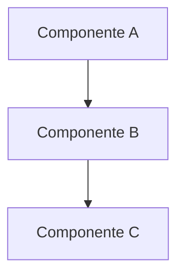
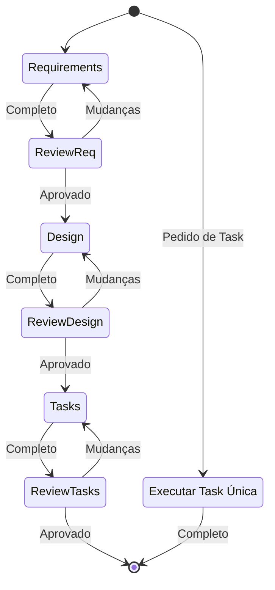

# Spec-Driven Development

Transforma ideias em especificações completas, documentos de design e planos de implementação acionáveis.

## Início Rápido

Ao mencionar criar uma spec, documento de design ou plano de implementação, este skill guia por:

1. **Requirements** → Define o que precisa ser construído (formato EARS com user stories)
2. **Design** → Determina como construir (arquitetura, componentes, modelos de dados)
3. **Tasks** → Cria passos de implementação acionáveis (incremental, test-driven)
4. **Execute** → Implementa tasks uma de cada vez

**Armazenamento**: Cria arquivos em `docs/engineering/tech-specs/{feature-name}/` (kebab-case)

## Quando Usar

- Criando uma nova especificação de feature
- Definindo requirements com critérios de aceite
- Desenhando arquitetura de sistema
- Planejando implementação de feature
- Executando tasks de uma spec existente

---

## Filosofia de Código

- Escrever o **mínimo absoluto** de código necessário
- Evitar implementações verbosas
- Focar apenas na funcionalidade essencial
- Seguir padrões existentes no projeto
- Abordagem test-driven

**Linguagem**: Responder no idioma do usuário (padrão: português)

---

<details>
<summary>📋 Fase 1: Levantamento de Requirements</summary>

## Fase de Requirements

Transforma uma ideia bruta em requirements estruturados com user stories e critérios de aceite EARS.

### Processo

1. **Gerar Requirements Iniciais**
   - Criar `docs/engineering/tech-specs/{feature-name}/requirements.md`
   - Usar kebab-case para o nome da feature (ex: "food-log", "user-auth")
   - Escrever requirements iniciais baseados na ideia do usuário
   - Não fazer perguntas sequenciais antes — gerar primeiro, iterar depois

2. **Estrutura dos Requirements**

```markdown
# Requirements — {Nome da Feature}

## Introdução

[Resumo da feature — qual problema resolve?]

## Requirements

### Requirement 1

**User Story:** Como [papel], quero [feature], para que [benefício]

#### Critérios de Aceite

1. WHEN [evento] THEN [sistema] SHALL [resposta]
2. IF [pré-condição] THEN [sistema] SHALL [resposta]
3. WHEN [evento] AND [condição] THEN [sistema] SHALL [resposta]

### Requirement 2

**User Story:** Como [papel], quero [feature], para que [benefício]

#### Critérios de Aceite

1. WHEN [evento] THEN [sistema] SHALL [resposta]
```

### Formato EARS

**Easy Approach to Requirements Syntax** — critérios de aceite estruturados:

- `WHEN [evento] THEN [sistema] SHALL [resposta]` — Orientado a evento
- `IF [condição] THEN [sistema] SHALL [resposta]` — Condicional
- `WHILE [estado] [sistema] SHALL [resposta]` — Orientado a estado
- `WHERE [feature] [sistema] SHALL [resposta]` — Ubíquo
- `[sistema] SHALL [resposta]` — Incondicional

### Revisão e Iteração

3. **Pedir Aprovação**
   - Após criar/atualizar requirements
   - Perguntar: "Os requirements estão bons? Se sim, podemos avançar para o design."
   - Fazer modificações se o usuário pedir
   - Continuar ciclo feedback-revisão até aprovação explícita
   - **NÃO avançar para design sem aprovação clara**

### Boas Práticas

- Considerar edge cases e restrições técnicas
- Focar em experiência do usuário e critérios de sucesso
- Sugerir áreas que precisam de esclarecimento
- Fazer perguntas direcionadas sobre aspectos específicos
- Decompor requirements complexos em partes menores
- Verificar alinhamento com `docs/product/domain/domain.md` e o PRD

</details>

<details>
<summary>🎨 Fase 2: Documento de Design</summary>

## Fase de Design

Criar documento de design abrangente baseado nos requirements aprovados, conduzindo pesquisa durante o processo.

### Pré-requisitos

- Garantir que `requirements.md` existe em `docs/engineering/tech-specs/{feature-name}/`
- Requirements devem ser aprovados antes da fase de design

### Fase de Pesquisa

1. **Identificar Necessidades de Pesquisa**
   - Quais tecnologias/padrões precisam de investigação?
   - Quais soluções existentes podem informar o design?

2. **Conduzir Pesquisa**
   - Usar recursos disponíveis (web search, documentação)
   - Consultar `docs/engineering/architecture/architecture.md` para decisões existentes
   - **Não criar arquivos separados de pesquisa**
   - Resumir achados relevantes
   - Citar fontes com links relevantes

### Estrutura do Documento de Design

Criar `docs/engineering/tech-specs/{feature-name}/design.md` com:

**Visão Geral**

- Descrição de alto nível da abordagem de design
- Decisões arquiteturais chave e justificativas

**Arquitetura**

- Visão geral da arquitetura do sistema
- Relacionamentos entre componentes
- Diagramas de fluxo de dados (usar Mermaid quando apropriado)

**Componentes e Interfaces**

- Descrições detalhadas dos componentes
- Especificações de API
- Contratos de interface

**Modelos de Dados**

- Schemas de banco de dados
- Estruturas de dados
- Abordagem de gerenciamento de estado

**Tratamento de Erros**

- Cenários de erro e estratégias de recuperação
- Abordagens de validação

**Estratégia de Testes**

- Abordagem de testes unitários
- Plano de testes de integração

### Exemplo de Design

````markdown
# Design — {Nome da Feature}

## Visão Geral

[Abordagem de alto nível e decisões chave]

## Arquitetura


````

## Componentes e Interfaces

### Componente A

- Propósito: [O que faz]
- Interfaces: [APIs que expõe]
- Dependências: [O que precisa]

## Modelos de Dados

```typescript
interface AlimentoModel {
  id: string;
  nome: string;
  calorias: number;
}
```

````

### Revisão e Iteração

3. **Pedir Aprovação**
   - Após criar/atualizar design
   - Perguntar: "O design está bom? Se sim, podemos avançar para o plano de implementação."
   - Fazer modificações se o usuário pedir
   - Continuar ciclo feedback-revisão até aprovação explícita
   - **NÃO avançar para tasks sem aprovação clara**

### Princípios Chave

- **Orientado a pesquisa**: Embasar decisões em pesquisa
- **Abrangente**: Endereçar todos os requirements
- **Visual quando útil**: Incluir diagramas
- **Documentar decisões**: Explicar justificativas
- **Refinamento iterativo**: Incorporar feedback
- **Registrar decisões arquiteturais** em `docs/engineering/architecture/architecture.md`

</details>

<details>
<summary>✅ Fase 3: Lista de Tasks de Implementação</summary>

## Fase de Tasks

Converter design aprovado em tasks de implementação acionáveis e test-driven.

### Pré-requisitos

- Garantir que `design.md` existe e está aprovado
- Requirements e design fornecem contexto para as tasks

### Instruções de Geração de Tasks

**Princípio Central**: Converter design em prompts para LLM implementar cada passo de forma test-driven.

**Focar em**:
- Progresso incremental com testes antecipados
- Construir sobre tasks anteriores — sem código órfão
- APENAS tasks envolvendo escrita, modificação ou teste de código
- Sem grandes saltos de complexidade

**Excluir**:
- Testes de aceite do usuário ou coleta de feedback
- Deploy para produção/staging
- Coleta de métricas de performance
- Execução manual da aplicação para testes (testes automatizados end-to-end são OK)
- Criação de documentação ou treinamento de usuários
- Mudanças de processo de negócio

### Formato das Tasks

Criar `docs/engineering/tech-specs/{feature-name}/tasks.md` com:

```markdown
# Plano de Implementação — {Nome da Feature}

- [ ] 1. Configurar estrutura do projeto e interfaces core
  - Criar estrutura de diretórios para models, services, repositories
  - Definir interfaces que estabelecem fronteiras do sistema
  - _Requirements: 1.1_

- [ ] 2. Implementar modelos de dados e validação
  - [ ] 2.1 Criar interfaces e tipos core dos modelos
    - Escrever interfaces TypeScript para todos os modelos
    - Implementar funções de validação para integridade dos dados
    - _Requirements: 2.1, 3.3, 1.2_

  - [ ] 2.2 Implementar modelo de Alimento com validação
    - Escrever classe Alimento com métodos de validação
    - Criar testes unitários para validação do modelo
    - _Requirements: 1.2_

[Tasks adicionais...]
````

### Requisitos das Tasks

**Estrutura**:

- Máximo dois níveis de hierarquia (tasks e sub-tasks)
- Usar notação decimal para sub-tasks (1.1, 1.2, 2.1)
- Cada item deve ser um checkbox
- Estrutura simples preferível

**Cada Task Deve Incluir**:

- Objetivo claro envolvendo código (escrita, modificação, teste)
- Informações adicionais como sub-bullets
- Referências específicas aos requirements

**Padrões de Qualidade**:

- Passos de código discretos e gerenciáveis
- Construção incremental sobre passos anteriores
- Desenvolvimento test-driven priorizado
- Cobre todos os aspectos do design implementáveis via código
- Valida funcionalidade core antecipadamente

### Revisão e Iteração

3. **Pedir Aprovação**
   - Após criar/atualizar tasks
   - Perguntar: "As tasks estão boas?"
   - Fazer modificações se o usuário pedir
   - Continuar ciclo feedback-revisão até aprovação explícita
   - **Parar após aprovação — não iniciar implementação**

### Conclusão

**Importante**: Este workflow é APENAS para criar artefatos de planejamento.

- NÃO implementar a feature como parte deste workflow
- Informar o usuário que pode executar as tasks pedindo: "execute a task 1" ou "implemente a task 2.1"

</details>

<details>
<summary>⚙️ Fase 4: Execução de Tasks</summary>

## Fase de Execução

Implementar tasks específicas da especificação de feature com precisão e foco.

### Pré-requisitos

**SEMPRE ler os arquivos de spec primeiro**:

- `docs/engineering/tech-specs/{feature-name}/requirements.md`
- `docs/engineering/tech-specs/{feature-name}/design.md`
- `docs/engineering/tech-specs/{feature-name}/tasks.md`

Nunca executar tasks sem entender o contexto completo.

### Processo de Execução

1. **Seleção de Task**
   - Se número/descrição da task fornecido: Focar nessa task específica
   - Se nenhuma task especificada: Revisar lista e recomendar próxima task lógica
   - Se task tem sub-tasks: Sempre completar sub-tasks primeiro

2. **Implementação**
   - **UMA task por vez** — Nunca implementar múltiplas sem aprovação
   - **Código mínimo** — Escrever apenas o necessário para a task atual
   - **Seguir o design** — Aderir às decisões de arquitetura
   - **Verificar requirements** — Garantir que implementação atende às specs

3. **Protocolo de Conclusão**
   - Após task completa, PARAR e informar o usuário
   - NÃO avançar para próxima task automaticamente
   - Aguardar revisão e aprovação do usuário
   - Marcar task como `[x]` no arquivo `tasks.md`
   - Ao finalizar a feature: atualizar a tech spec com o que foi efetivamente implementado, incluindo divergências do planejado (conforme `CLAUDE.md`)

### Princípios de Eficiência

- **Operações paralelas**: Executar operações independentes simultaneamente
- **Edições em lote**: Usar múltiplas edições para mudanças no mesmo arquivo
- **Minimizar passos**: Completar tasks no menor número de operações
- **Verificar o trabalho**: Confirmar que implementação atende aos requirements

### Padrões de Resposta

**Para pedidos de implementação**:

1. Ler arquivos de spec relevantes
2. Identificar a task específica
3. Implementar com código mínimo
4. Parar e aguardar revisão

**Para pedidos de informação**:

- Responder diretamente sem iniciar implementação
- Exemplos: "Qual é a próxima task?", "Quais tasks faltam?"

</details>

---

## Regras do Workflow

- **Nunca pular fases** — Sempre progredir sequencialmente
- **Aprovação explícita obrigatória** — Obter aprovação do usuário após cada documento
- **Sem passos combinados** — Não mesclar múltiplas fases
- **Refinamento iterativo** — Continuar feedback-revisão até aprovação
- **Uma task por vez** — Durante execução, focar em task única

## Diagrama do Workflow



## Lógica de Detecção

Determinar estado atual verificando:

```powershell
# Verificar diretório de tech-specs
$specsPath = "docs/engineering/tech-specs"
if (Test-Path $specsPath) {
  # Listar features
  Get-ChildItem $specsPath -Directory

  # Para feature específica, verificar fase
  $feature = "food-log"
  if (Test-Path "$specsPath/$feature/requirements.md") { "Requirements existe" }
  if (Test-Path "$specsPath/$feature/design.md") { "Design existe" }
  if (Test-Path "$specsPath/$feature/tasks.md") { "Tasks existe — pronto para execução" }
}
```

## Resumo

Workflow estruturado e iterativo para desenvolvimento de features:

- Começar com **requirements** (o que construir)
- Avançar para **design** (como construir)
- Criar **tasks** (passos de implementação)
- **Executar** tasks uma de cada vez

Cada fase requer aprovação explícita do usuário antes de avançar, garantindo alinhamento e qualidade ao longo do processo.
