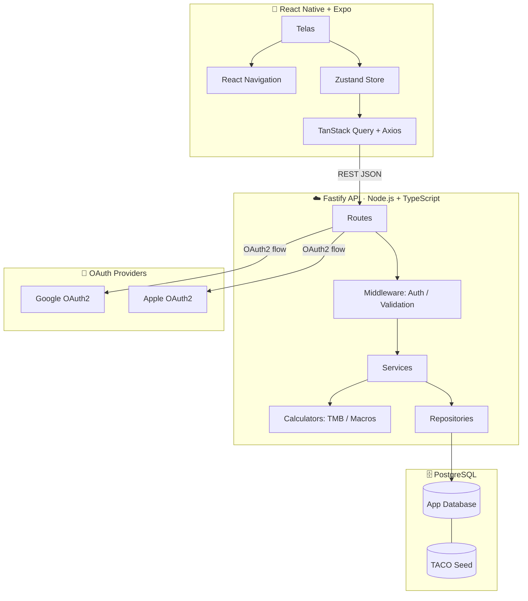
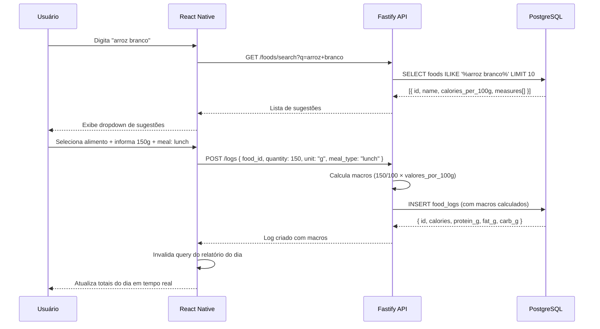
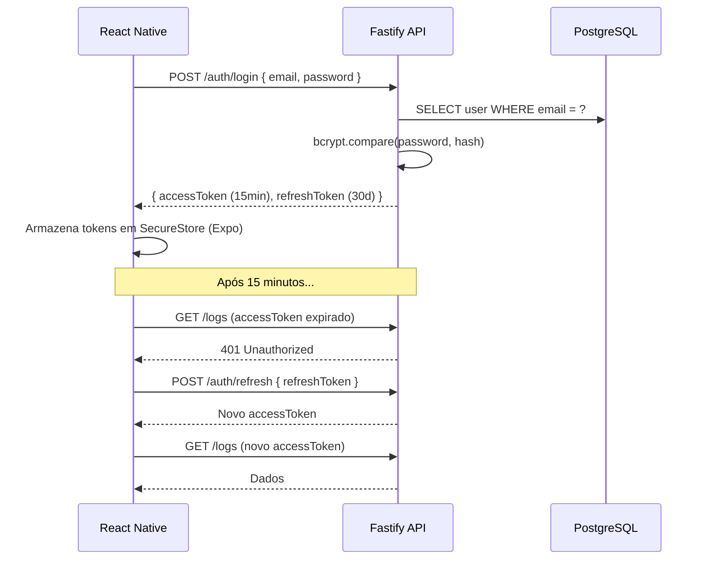

# Arquitetura — App de Controle Nutricional

## Visão Geral

Arquitetura cliente-servidor com frontend mobile em React Native + Expo e backend RESTful em Node.js/Fastify com TypeScript. A base de dados nutricional (TACO) é pré-populada via seed estático. Autenticação via JWT com refresh tokens e suporte a OAuth2 (Google, Apple).

---

## Diagrama de Componentes



---

## Stack Tecnológica

| Camada | Tecnologia | Justificativa |
|--------|-----------|---------------|
| Mobile | React Native + Expo SDK 51 | Cross-platform iOS/Android com uma base de código |
| Navegação | React Navigation 6 | Padrão do ecossistema RN; suporte a Stack e Tab |
| Estado global | Zustand | Minimal, sem boilerplate, suficiente para o MVP |
| HTTP / Cache | TanStack Query + Axios | Cache automático, loading states e retry |
| Backend | Node.js 20 + Fastify 4 + TypeScript | Melhor throughput que Express; type-safety nativa |
| ORM | Prisma | Type-safe, migrations automáticas, excelente DX |
| Banco de dados | PostgreSQL 15 | Relacional, ACID, JSON support para flexibilidade futura |
| Autenticação | JWT (access 15min + refresh 30d) | Stateless, escalável, sem session server |
| OAuth | Passport.js | Adapters prontos para Google e Apple |
| Base nutricional | TACO v7 (seed estático) | Dados brasileiros validados cientificamente, gratuitos |
| Validação de entrada | Zod | Type-safe, schemas compartilháveis entre front e back |

---

## Decisões Arquiteturais

### DA-01 — Expo ao invés de React Native CLI
Expo gerencia a complexidade de builds nativos, especialmente Sign in with Apple (obrigatório na App Store) e permissões de câmera/notificações futuras. O managed workflow é suficiente para o MVP.

### DA-02 — TACO como base nutricional seed estático
A TACO (Tabela Brasileira de Composição de Alimentos, UNICAMP) é gratuita, validada cientificamente e focada em alimentos do contexto brasileiro. Será importada uma vez como seed no banco, sem dependência de API externa em runtime.

### DA-03 — Cálculo de macros exclusivamente no backend
Todas as regras de negócio (TMB, metas, conversão de medidas, cálculo de macros) ficam no backend. O frontend envia os parâmetros e exibe os resultados. Garante consistência e evita divergências se as fórmulas mudarem.

### DA-04 — Macros desnormalizados no FoodLog
`calories`, `protein_g`, `fat_g` e `carb_g` são gravados no `food_log` no momento do registro, não calculados dinamicamente. Isso simplifica queries de relatório e preserva o histórico mesmo se os dados do alimento mudarem.

### DA-05 — Arquitetura em camadas (Routes → Services → Repositories)
- **Routes**: validação de entrada com Zod + autenticação
- **Services**: lógica de negócio pura, sem acesso direto ao banco
- **Repositories**: acesso ao banco via Prisma, sem lógica de negócio

---

## Fluxo de Dados — Registro de Alimento



---

## Fluxo de Autenticação



---

## Estrutura de Diretórios

```
app-nutricional/
├── apps/
│   ├── mobile/                  # React Native + Expo
│   │   ├── src/
│   │   │   ├── screens/
│   │   │   ├── components/
│   │   │   ├── navigation/
│   │   │   ├── stores/          # Zustand
│   │   │   ├── queries/         # TanStack Query hooks
│   │   │   └── lib/             # Axios instance, utils
│   │   └── app.json
│   └── api/                     # Fastify API
│       ├── src/
│       │   ├── routes/
│       │   ├── services/
│       │   ├── repositories/
│       │   ├── calculators/
│       │   ├── middlewares/
│       │   └── lib/             # Prisma client, JWT
│       └── prisma/
│           ├── schema.prisma
│           ├── migrations/
│           └── seeds/
└── packages/
    └── shared/                  # Tipos e schemas Zod compartilhados
```

---

## Ambientes

| Ambiente | API | Banco | Deploy |
|----------|-----|-------|--------|
| `development` | localhost:3000 | Docker Compose | Manual |
| `staging` | Railway (branch `develop`) | Railway Postgres | Push automático |
| `production` | Railway (branch `main`) | Railway Postgres | Push na `main` com migrations |
