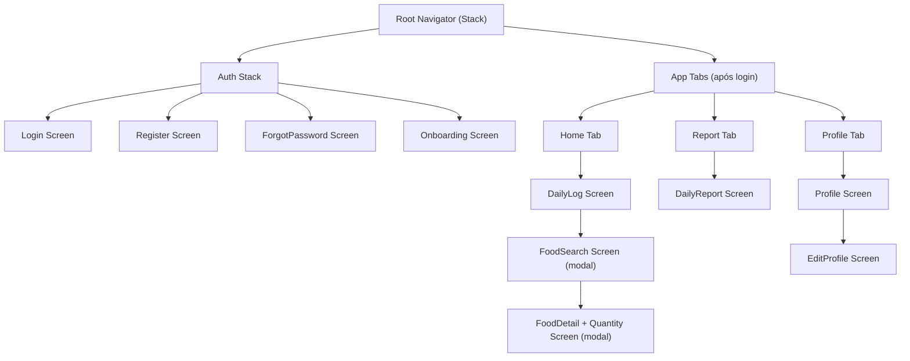

# Frontend — App de Controle Nutricional

## Stack

| Tecnologia | Versão | Uso |
|------------|--------|-----|
| React Native | 0.74 | Base cross-platform |
| Expo SDK | 51 | Build, auth, secure storage |
| React Navigation | 6 | Navegação entre telas |
| Zustand | 4 | Estado global (auth, user) |
| TanStack Query | 5 | Cache e sincronização com API |
| Axios | 1.6 | HTTP client com interceptors |
| React Hook Form + Zod | 7 + 3 | Formulários com validação type-safe |
| NativeWind | 4 | Tailwind CSS para React Native |
| Expo SecureStore | — | Armazenamento seguro de tokens JWT |

---

## Mapa de Navegação



---

## Telas

### Auth Stack

#### `LoginScreen`
- Campos: e-mail, senha
- Botões: "Entrar", "Entrar com Google", "Entrar com Apple"
- Links: "Esqueci minha senha" → `ForgotPasswordScreen` | "Criar conta" → `RegisterScreen`
- Estado de loading no botão durante autenticação

#### `RegisterScreen`
- Campos: nome, e-mail, senha, confirmação de senha
- Validação em tempo real com Zod
- Feedback de força da senha

#### `ForgotPasswordScreen`
- Campo: e-mail
- Exibe mensagem genérica de sucesso independente de o e-mail existir

#### `OnboardingScreen`
- Fluxo em steps (React Navigation ou scroll paginado):
  1. Data de nascimento (DatePicker nativo)
  2. Sexo (botões de toggle)
  3. Altura (slider ou input numérico)
  4. Peso (input numérico com unidade)
  5. % Gordura (opcional, campo numérico + skip)
- Botão "Continuar" habilitado apenas quando campos obrigatórios preenchidos
- Exibe TMB calculada na tela de confirmação antes de salvar

---

### App Tabs

#### `DailyLogScreen` (tab Home)
Tela principal do app.

**Layout**:
```
┌─────────────────────────────────┐
│ ← Seg 13/01    hoje    Qui 15/01→ │  (navegação de data)
├─────────────────────────────────┤
│  [Resumo Calórico — mini card]  │  (atalho para Report)
│  1450 / 2300 kcal  63%          │
├─────────────────────────────────┤
│ Café da Manhã           + Add   │
│  • Ovo frito 60g    93 kcal     │
│  • Pão francês 50g  132 kcal    │
├─────────────────────────────────┤
│ Almoço                  + Add   │
│  (vazio)                        │
├─────────────────────────────────┤
│ Jantar                  + Add   │
│ Lanche                  + Add   │
└─────────────────────────────────┘
```

- Swipe-to-delete em itens do log
- Toque em item → editar quantidade (bottom sheet)
- "+ Add" → abre `FoodSearchScreen` como modal

#### `FoodSearchScreen` (modal)
- Input de busca com debounce de 300ms
- Lista de resultados da API com nome, calorias/100g e categoria
- Estado vazio: "Nenhum alimento encontrado"
- Estado de loading: skeleton list

#### `FoodDetailScreen` (modal após selecionar alimento)
- Exibe nome e macro table do alimento
- Toggle: gramas / medidas caseiras
  - Gramas: input numérico
  - Medidas: dropdown com opções da API (ex: "1 colher de sopa", "1 xícara")
- Preview em tempo real dos macros calculados conforme a quantidade muda
- Botão "Adicionar ao log"

---

#### `DailyReportScreen` (tab Relatório)
**Layout**:
```
┌─────────────────────────────────┐
│  Terça, 14 de Janeiro           │
├─────────────────────────────────┤
│  ┌─────────────────────────┐    │
│  │  🔥 1450 / 2300 kcal    │    │
│  │  ██████████░░░░░ 63%    │    │
│  │  -850 kcal (déficit)    │    │
│  └─────────────────────────┘    │
├─────────────────────────────────┤
│  Proteína  98 / 165g   ████░  │
│  Gordura   52 /  77g   █████░  │
│  Carboidr. 145/ 230g   ████░  │
└─────────────────────────────────┘
```

- Cores: déficit = verde, superávit = vermelho, on_target = azul
- Navegação de datas (mesma do DailyLogScreen, estado compartilhado via Zustand)

---

#### `ProfileScreen` (tab Perfil)
- Exibe nome, e-mail, idade calculada, sexo, altura, peso, % gordura, TMB
- Botão "Editar" → `EditProfileScreen`
- Botão "Sair" com confirmação

#### `EditProfileScreen`
- Formulário com campos pré-preenchidos do perfil atual
- Validação antes de salvar
- Exibe nova TMB calculada em preview antes de confirmar

---

## Estado Global (Zustand)

```typescript
interface AuthStore {
  user: User | null
  accessToken: string | null
  refreshToken: string | null
  isAuthenticated: boolean
  login: (tokens: Tokens, user: User) => void
  logout: () => void
  setTokens: (tokens: Tokens) => void
}

interface AppStore {
  selectedDate: string  // YYYY-MM-DD
  setSelectedDate: (date: string) => void
}
```

Os tokens são persistidos no `Expo SecureStore`. Na inicialização do app, o `AuthStore` lê do SecureStore e tenta validar o refresh token antes de redirecionar.

---

## Queries TanStack Query

| Hook | Endpoint | Cache key |
|------|----------|-----------|
| `useCurrentUser` | GET /users/me | `['user', 'me']` |
| `useFoodSearch(q)` | GET /foods/search?q= | `['foods', 'search', q]` |
| `useDailyLog(date)` | GET /logs?date= | `['logs', date]` |
| `useDailyReport(date)` | GET /reports/daily?date= | `['report', date]` |

Mutações de log (`addLog`, `updateLog`, `deleteLog`) invalidam `['logs', date]` e `['report', date]`.

---

## Tratamento de Erros de Rede

- **401** → interceptor Axios tenta refresh; se falhar, chama `AuthStore.logout()`
- **Offline** → TanStack Query retorna cache stale com indicador visual
- **500** → Toast com mensagem genérica "Algo deu errado, tente novamente"

---

## Acessibilidade

- Todos os inputs com `accessibilityLabel` e `accessibilityHint`
- Botões com tamanho mínimo de toque de 44×44pt (guideline Apple/Google)
- Contraste de cores mínimo 4.5:1 (WCAG AA)
- Suporte a Dynamic Type (iOS) e font scaling (Android)
